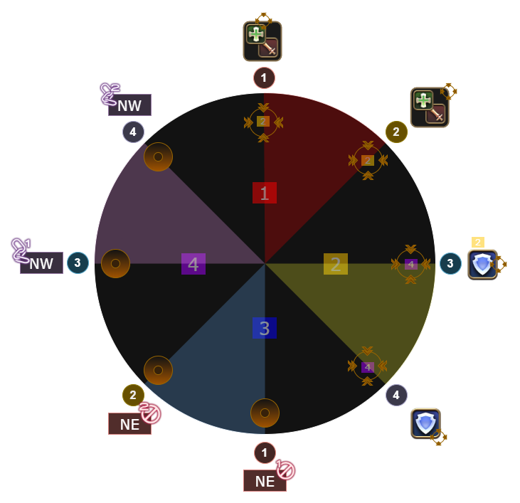
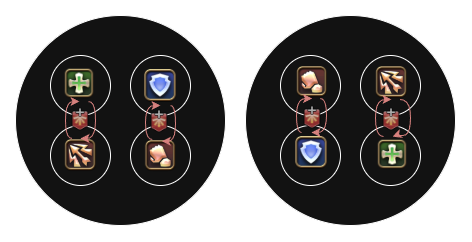
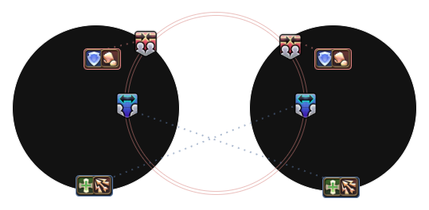
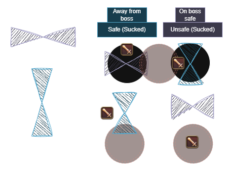

## Idyllic Dream

In total, there are three types of mechanics to deal with:
- Stacks and defams with a Reenactment section
- Telegraphed AoEs (N/S cleaves + Middle AoE adds)
- Towers

This section starts off with a heavy raidwide damage **Idyllic Dream** which transitions the stage.

1. **Staging + Replication** - Reenactment clones appear in sets of four, either starting at cardinals or intercardinals. The clones will turn into players themselves, storing defam/stack mechanics later on. These will go off near the end, with two sets each.
    > To remember: Cardinals or Intercardinals first
    {: .prompt-warning }

    First, make sure you find your cloned self. We again split all player clones into two sections.
      - Starting from north, count 1 to 4 clockwise. These will be the party stacks.
      - Starting from south, count 1 to 4 clockwise. These will be the defams.

    It is crucial to know which side you are on and your number. The image down below serves as a cheat sheet.

    {: w='500'}_Figure 1: Stacks and defamination spots_
    
2. **Twisted Vision** - Everytime this cast appears, the stage will transition to another dimension, telegraphing or resolving a new set of mechanics. In this case, it will be telegraphed AoEs from 3 boss clones.
3. **Replication** - Three boss clones, one at each north and south cardinal and the third one being at the middle, will telegraph AoEs. The middle clone will always telegraph a point blank AoE, and the other two will either be a front/back or side cleaves. We need to take note of which clone gives us the safe spot to dodge these AoEs. In this case, the clone that telegraphs front/back cleave to leave the sides safe. This can be either north or south clones. 
    > To remember: North or South safe
    {: .prompt-warning }

    The AoEs will not do damage, so you can preposition to your quadrant for the next dimension change.

4. **Twisted Vision (Tether Swaps)** - The boss will spawn two clones at a time, starting from north and south and going clockwise. Players should have prepositioned in their quadrants and figured out which mechanic they needed to store based on their acting LPs. Additionally, we need to take note if stacks or defams were first at the north and south boss clones. To make it easier, you can look at any cardinal in your quadrant and check what mech it is telegraphing.

    > To remember: Stacks or defams first
    {: .prompt-warning }

5. **Twisted Vision (N/S Safe)** - Right before the cast, the tethers from the boss clones will lock in. We need to move to the safe spot and if possible, to our correct *true* LP platform.

    > Recall: North or South safe
    {: .prompt-danger }

    **Lindwurm's Meteor** is a raidwide that carves out two platforms from the main one. During this cast, everyone should run to their right platform, with G1 left and G2 right (true north). Facing the boss, supports will be left and DPS will be right. Melees are front and ranged are back. Make sure to spread out evenly as we will be soaking 4 towers later.  

6. **Arcadian Arcanum + Swaps** - Four towers will spawn in each platform and the meteors above it need to be soaked. There are four types of meteors:
    - Fire - Pyretic. You can keep attacking the boss but not move for 5 seconds.
    - Earth - Move away after soaking as a twister will spawn underneath. Stay in the boss hitbox or at the 2/4 markers to be safe.
    - Dark - Aim the Doom laser by standing on the edge of it, away from everyone else. A healer will need to cleanse the doom. 
    - Wind - Stand near the edge so that you get knockbacked to the opposite platform. Stay in the boss hitbox or at the 2/4 markers to not get clipped by the platform's twister.  

    Note that any of the meteors can be tri-colored, i.e. light at the top, any of the four in the middle, and dark at the bottom.

    Additionally, a Light Vuln debuff will be applied to either one role. If a player has a tri-colored meteor, they *cannot* soak it if they have the debuff. They need to swap with their partner (vertically) who is of opposite role.

    {: w='300'}_Figure 2: Tower positions and swaps_

7. **Twisted Vision (Stacks/Defams)** - Immediately after transitioning, recall whether stacks or defams were first. 
    - If stacks first: (1) and (2) stack players need to position at 4 and 2 markers respectively. Being at the same marker will cause a wipe. (3) and (4) stacks will need to do the same for the second set of stacks.
    - If defams first: (1) and (2) defam players need to drop uptime and go at NE and NW respectively. Hesitating or greeding will cause a wipe. (3) and (4) defams will need to do the same for the second set of defams.

    The order goes Stacks-Defams-Stacks-Defams or Defams-Stacks-Defams-Stacks depending on the pattern from earlier, roughly 4 seconds apart. 

    Please refer to Fig. 1 for the cheat sheet. This is the hardest part and the main cause of wipes imo.

    > Recall: Stacks or defams first
    {: .prompt-danger }

    When everything is resolved, go back to your respective LP platform to prepare to soak the meteors from before.

8. **Twisted Vision + Cosmic Kiss** - Players have 4 seconds to remember which tower they have to soak and how to deal with its respective mech afterwards. After soaking, dooms, pyretic, and KB will happen at the same time. After 5 seconds, the twisters will go off and the pyretic will stop. 

    To not get hit by the twister, the 4/2 markers and the boss hitbox will always be safe from it, especially when you get the KB tower.

9. **Lindwurm's Glare/Thunder II (Near/Far baits)** - After the twisters going off and pyretic resolving, near and far debuffs will be applied to certain players depending on which tower they soaked.
    - Near debuff (red) will position north, touching the ring of the boss hitbox.
    - Far debuff (blue) will position middle, touching the ring of the boss hitbox.
    - Non-debuff melee will position between Near/Far players, within max melee of the boss to bait the Near debuff.
    - Non-debuff ranged will position directly south of the platform, baiting the Far debuff from the other side.

    {: w='500'}_Figure 3: Bait positions_

10. **Temporal Curtain** - The safe or unsafe add will get sucked into a portal, these were determined from what we memorized earlier (N/S safe). The point blank AoE clone will teleport to one of the platforms, making one "unsafe".

    > To remember: East or West safe
    {: .prompt-warning }

    To make it easier to dodge, there are two patterns to be aware of:
    - Safe add gets sucked (away): The unsafe add will teleport to the "safe" platform and do side cleaves. We need to be either north or south of the platform, *away* from the boss to dodge it safely.
    - Unsafe add gets sucked (on): The safe add will teleport to the "safe" platform and do front/back cleaves. We need to stay *on* the boss hitbox to dodge these. 

    The add that gets sucked into the portal will appear again later on, and we need to dodge the cleaves. Remembering the two patterns above will make this easier. 

    {: w='500'}_Figure 4: On boss and away from boss patterns_

11. **Twisted Vision (Cards/Intercards)** - After transitioning, we need to recall whether cardinals or intercardinals were first. 
    - If cardinals first: the N and E stacks will go off. Tanks will need to soak the east stack and the rest of the party will go up north.
    - If intercards first: NE and SE stacks will go off. Tanks will need to soak the SE stack and the rest of the party will soak NE.

    **Important:** The defams at the west side are huge enough to clip people. Ensure that you are slightly close to the wall to avoid getting clipped by it.

    > Recall: Cardinals or Intercardinals first
    {: .prompt-danger }

12. **Twisted Vision (E/W)** - Immediately go to the "safe" platform (either E/W) and recall if you have to be on the boss or away from the boss. 

    > Recall: East or West safe
    {: .prompt-danger }

13. **Twisted Vision (Cards/Intercards + On/Away)** - Similar to (11) but with the other pattern instead. After soaking the stack, immediately be on the boss or away from the boss to dodge the cleave that is happening at north.

    > Recall: Other card/intercard stack + On the boss or away from the boss
    {: .prompt-danger }

The phase ends with another cast of **Idyllic Dream**, another raidwide. Then there will be a **Double Sobat + Estoric Finisher** tankbusters, and three sets of **Arcadian Hell** raidwides with the final one being the enrage.

## Cheatsheet

TBA

## Clear POVs
These are clear videos uploaded by friends whom I played with. Please check out their POVs for reference!

### AST (H1)


### PCT (R2)

